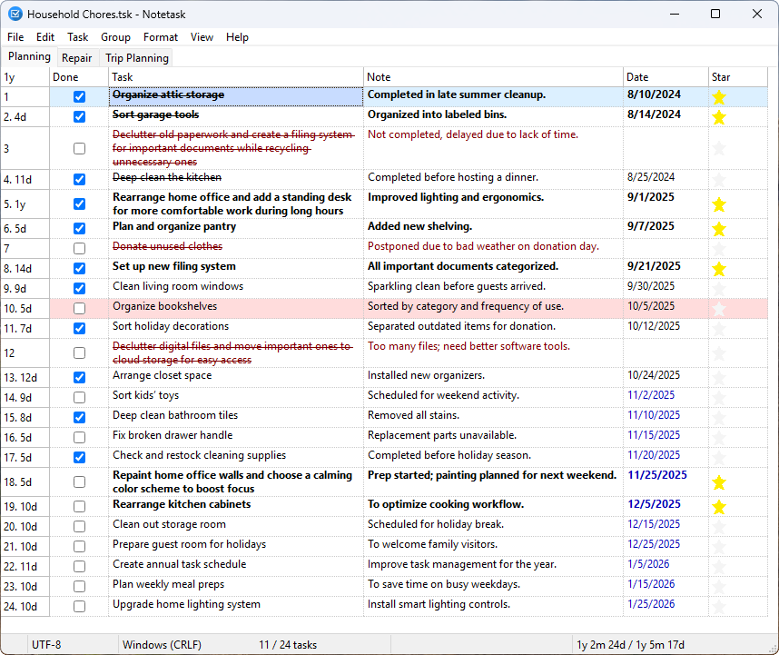

# Notetask
A simple application for creating and organizing task lists, offering essential features for efficient task management, similar to Notepad in its simplicity and functionality.

[](https://www.gnu.org/licenses/gpl-3.0)
[](https://www.lazarus-ide.org/)
[](#)
[](https://www.ethnologue.com)

>- [Notetask](#notetask)
>   - [Description](#description)
>   - [Features:](#features)
>- [File Format](#file-format)
>   - [Legend](#legend)
>   - [Example](#example)
>- [Licensing](#licensing)

## Description

**Notetask** is a cross-platform application to manage task lists with *completion status*, *text*, and *comments*. Each task can have a due *date* and be marked as a favorite with a *star*.



### Features:
- **Automatic numbering** of tasks  
- **Task moving** — move one or multiple tasks, within or between groups  
- **Archiving** — archived tasks are crossed out and can be **hidden or shown**  
- **Grouping** — each group is displayed on a **separate page**, with **group management** support  
- **Duration tracking** for each task (can be **enabled or disabled**)  
- **Total duration calculation** — for all or selected tasks  
- **Status bar summary** — shows time separately for **completed** and **incomplete** tasks  
- **Overdue tasks highlighting** — overdue tasks are **automatically marked**  
- **Merging** — combine multiple tasks into a single one  
- **Indent** — create subtasks and **task trees**

### Shoping list
Notetask allows you to keep a shopping list with item prices and see the total cost in the status bar, including purchased items.


### Notes
Suitable for note-taking with an optional general note field at the bottom of the application window, as well as support for paged grouping and all task management features.


Supports advanced features, such as running selected comments directly from the notes as console commands.


All main functions are accessible via keyboard shortcuts.
 
 

## File Format

Notetask uses a simple Markdown-based format (file extension .tsk) where each line represents a single task with the following structure:

```md
## Group
- [x] Date, Amount, ~~**Text**~~ // Note   
```
### Legend

- `## Group` — the group title, marking the start of a set of related tasks  
- `- [x] or - [ ]` — task completion status ([x] = done, [ ] = pending)
- `Date` — task date in format dd.mm.yyyy or similar
- `Amount` — numeric value related to the task (e.g., duration, cost, quantity)
- `~~**Text**~~` — task description, crossed out if archived, bold if marked as favorite with a star
- `// Note` — optional comment or additional information about the task


### Example

>## Planning
>- [x] 2024-08-10, ~~**Organize attic storage**~~ // Completed in late summer cleanup.
>- [x] 2024-08-14, ~~**Sort garage tools**~~ // Organized into labeled bins.
>- [ ] ~~Declutter old paperwork and create a filing system for important documents while recycling unnecessary ones~~ // Not completed, delayed due to lack of time.
>- [x] 2024-08-25, ~~Deep clean the kitchen~~ // Completed before hosting a dinner.
>- [x] 2024-09-01, **Rearrange home office and add a standing desk for more comfortable work during long hours** // Improved lighting and ergonomics.
>- [x] 2024-09-07, **Plan and organize pantry** // Added new shelving.
>- [ ] ~~Donate unused clothes~~ // Postponed due to bad weather on donation day.
>- [x] 2024-09-21, **Set up new filing system** // All important documents categorized.
>- [x] 2024-09-30, Clean living room windows // Sparkling clean before guests arrived.
>- [x] 2024-10-05, Organize bookshelves // Sorted by category and frequency of use.
>- [x] 2024-10-12, Sort holiday decorations // Separated outdated items for donation.
>## Repair
>- [ ] 2024-07-15, Replace leaking kitchen faucet // Scheduled plumber visit.
>- [ ] 2024-07-20, Fix broken garage door opener // Order replacement parts.
>- [ ] 2024-07-25, Repair cracked bathroom tiles // Awaiting tile delivery.
>- [ ] 2024-07-30, Service heating system before winter // Book technician.
>- [ ] 2024-08-05, Paint front door and touch up exterior walls // Prepare paint and materials.

## Licensing

Notetask is licensed under the GPL v3 license. See the LICENSE file for details.

The Notetask application uses third-party resources licensed as described in the THIRD_PARTIES file.