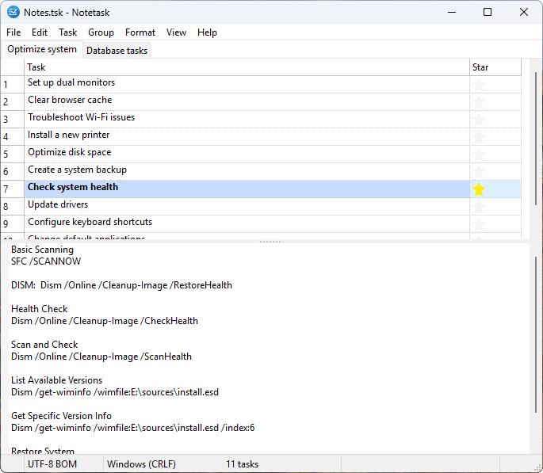
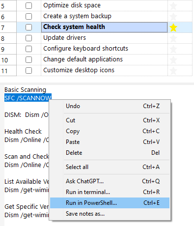

# Notetask
A simple application for creating and organizing task lists, offering essential features for efficient task management, similar to Notepad in its simplicity and functionality.

[](https://www.gnu.org/licenses/gpl-3.0)
[](https://www.lazarus-ide.org/)
[](#)
[](https://www.ethnologue.com)

>- [Notetask](#notetask)
>   - [What is it?](#what-is-it)
>   - [Features](#features)
>   - [Demo](#demo)
>- [File Format](#file-format)
>   - [Legend](#legend)
>   - [Example](#example)
> - [Installation](#installation)
>   - [Windows](#windows)
>   - [Linux](#linux)
>- [Featured on](#featured-on)
>- [Licensing](#licensing)

## What is it?

Do you often save important ideas, to-do lists, phone numbers, or command-line snippets in random text files, hoping to find them later… only to forget where exactly you put them? No more wasted time searching — **Notetask** helps bring order to the chaos!  
All your notes can be stored locally on your device — no clouds, no third parties.  
This handy desktop app helps you organize your tasks, capture ideas, and manage your lists — with no more confusion!

**Notetask** is a cross-platform application for managing task lists that include *completion status*, *task description*, and *notes*. Each task can have a due *date* and be marked as a favorite with a *star*. It uses its own storage text format based on Markdown.


It is designed to help you quickly organize a large number of small routine tasks. You can enter tasks directly in the app or paste raw text from the clipboard — such as a list of requirements or ideas — then sort them into groups, set durations or amounts, and start working right away. Perfect for managing project to-dos, bug lists, feature requests, and other ongoing tasks.

## Features:
- **Numbering** — Tasks are numbered automatically based on their order of appearance in the file
- **Multiline** — Tasks and notes with an option to submit or insert a line break when pressing Enter
- **Move tasks** — single or multiple, within or between groups; task priority is set simply by its position in the list
- **Archive tasks** — cross out archived items, which can be hidden or shown as needed
- **Grouping** — each group on its own page, with full group management
- **Track duration** — per-task (on/off) and **total duration** for all or selected tasks
- **Track amount** — per-task quantities or prices and **total amount** for all or selected tasks
- **Merge tasks** — combine multiple tasks into one
- **Split tasks** — split a single task into multiple tasks based on the selected column; each line break in the column becomes a new task, while all other columns are copied to each new task
- **Indent tasks** — create subtasks and task hierarchies
- **Highlight** — automatic background highlighting of overdue tasks, text highlighting of archived but incomplete tasks and blue text for tasks with a future due date
- **Copy tasks** — copy selected tasks or fields in Markdown format
- **Paste tasks** — insert individual fields or entire tasks from clipboard
- **Encrypt files** — password-based encryption and decryption of task files for secure storage and sharing
- **Customize columns** — toggle visibility of columns and interface elements (e.g., duration, note field, status bar)
- **Status bar summary** — shows totals of dates and amounts separately for **completed** and **incomplete** tasks

### Shopping list
**Notetask** allows you to keep a shopping list with item prices and see the total cost in the status bar, including the cost of purchased items.


### Notes
Suitable for note-taking with an optional general note field at the bottom of the application window, as well as support for paged grouping and all task management features.



### Personal Information
Suitable for storing personal information in encrypted files, with secure access and optional grouping for better organization.


Supports advanced features such as executing selected comments, tasks, or the entire script from notes as console commands.



### Encryption
Notetask can encrypts files using AES-256 in CBC mode with a key derived via PBKDF2-HMAC-SHA256. The derived 64-byte key is split into a 32-byte encryption key and a 32-byte HMAC key. Files are compressed using zlib before encryption, and a SHA-256 HMAC over the salt, IV, and ciphertext ensures integrity and authenticity.

The user can save an encrypted binary file with password protection. If the password is left empty, the file is still encrypted but without password protection, storing only the compressed data in the encrypted format.

To save an encrypted file, the corresponding format must be selected in the file save dialog.


### Shortcuts
Nearly all major features can be accessed through convenient keyboard shortcuts.  
View menu settings are saved individually based on filename.
 
 

### Summary

The status bar provides a concise, real-time overview of the current task list. These values are dynamically calculated based on either the full list of the current group or the currently selected tasks. It displays:
- **Text encoding** (e.g., UTF-8) and **line ending** style (e.g., CRLF)  
- **Completed tasks / Total tasks**  
- **Total amount spent / Total amount for all tasks** — useful for shopping lists or financial tracking  
- **Elapsed time / Estimated total time** — helps monitor progress on timed tasks.


## Demo


## File Format

**Notetask** uses a simple *plain text* format based on *Markdown* (file extension .tsk), where **each line represents a single task** with the following structure:

```md
## Group // Tooltip
- [x] Date, Amount, ~~**Text**~~ // Note <br>
```
### Legend
*All fields are optional. A task line may include any combination of them.*
- `## Group` — the group title, marking the start of a set of related tasks  
- `// Tooltip` — tooltip with the group description
- `- [x] or - [ ]` — task completion status ([x] = done, [ ] = pending)
- `Date` — task date and optional timestamp in ISO 8601 format `yyyy-MM-ddTHH:mm:ss`
- `Amount` — numeric value related to the task (e.g., cost, quantity), using a dot `.` as the decimal separator
- `~~**Text**~~` — task description, bold if marked as favorite with a star, and crossed out if archived (inactive regardless of completion)
- `// Note` — comment or additional information about the task
- `<br>` — line break in a note or task

### Example

>## Planning
>- [x] 2024-08-10, ~~**Organize attic storage**~~ // Completed in late summer cleanup.
>- [x] 2024-08-14, ~~**Sort garage tools**~~ // Organized into labeled bins.
>- [ ] ~~Declutter old paperwork and create a filing system for important documents while recycling unnecessary ones~~ // Not completed, delayed due to lack of time.
>- [x] 2024-08-25, ~~Deep clean the kitchen~~ // Completed before hosting a dinner.
>- [x] 2024-09-01, **Rearrange home office and add a standing desk for more comfortable work during long hours** // Improved lighting and ergonomics.
>- [x] 2024-09-07, **Plan and organize pantry** // Added new shelving.
>- [ ] ~~Donate unused clothes~~ // Postponed due to bad weather on donation day.
>- [x] 2024-09-21, **Set up new filing system** // All important documents categorized.
>- [x] 2024-09-30, Clean living room windows // Sparkling clean before guests arrived.
>- [x] 2024-10-05, Organize bookshelves // Sorted by category and frequency of use.
>- [x] 2024-10-12, Sort holiday decorations // Separated outdated items for donation.
>## Repair
>- [x] 2024-07-15, ~~Replace leaking kitchen faucet~~ // Scheduled plumber visit.
>- [x] 2024-07-20, Fix broken garage door opener // Order replacement parts.
>- [ ] 2024-07-25, Repair cracked bathroom tiles // Awaiting tile delivery.
>- [x] 2024-07-30, Service heating system before winter // Book technician.
>- [ ] 2024-08-05, Paint front door and touch up exterior walls // Prepare paint and materials.

## Installation

[](https://github.com/plaintool/notetask/releases/latest)

### Windows

Download the installer executable from the [releases page](https://github.com/plaintool/Notetask/releases). Run the installer and follow the on-screen instructions to complete the installation. After installation, you can launch Notetask from the Start menu or desktop shortcut.

---

### Linux
*Debian-like systems*

Download the appropriate `.deb` package for your system from the [releases page](https://github.com/plaintool/Notetask/releases). To install the package, open a terminal and run:

```bash
sudo dpkg -i /path/to/notetask.deb
```
If there are missing dependencies, fix them by running:
```bash
sudo apt-get install -f
```
To remove Notetask from your system, use:

```bash
sudo dpkg -r notetask
```

*Fedora-like systems*

Download the appropriate .rpm package for your system. To install the package, open a terminal and run:
```bash
sudo dnf install /path/to/notetask.rpm
```
If there are missing dependencies, fix them by running:
```bash
sudo dnf install -y gtk2
```
To remove Notetask from your system, use:

```bash
sudo dnf remove notetask
```

Some Notetask functions can run scripts in a terminal.
If no terminal emulator is installed, you can add one, for example:

```bash
sudo dnf install -y xterm
```

## Featured on
Notetask has been reviewed and listed on reputable software directories:

- [MajorGeeks](https://www.majorgeeks.com/files/details/notetask.html)
- [Softpedia](https://www.softpedia.com/get/Office-tools/Diary-Organizers-Calendar/Notetask.shtml)
- [AlternativeTo](https://alternativeto.net/software/notetask/about/)

## Licensing

Notetask is licensed under the GPL v3 license. See the LICENSE file for details.

The Notetask application uses third-party resources licensed as described in the [THIRD_PARTIES](THIRD_PARTIES) file.