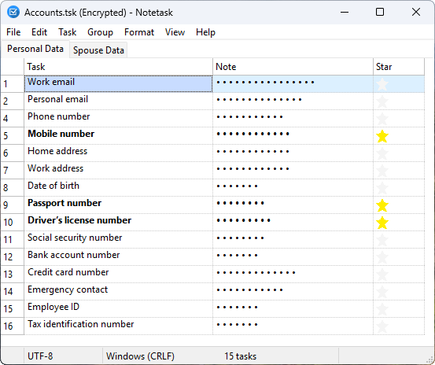
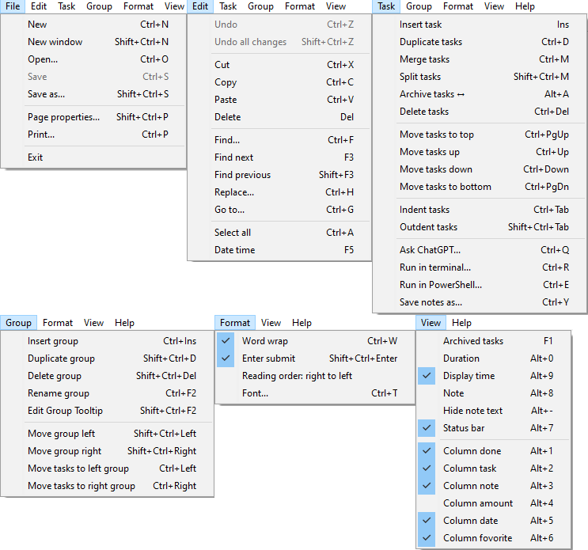

# Notetask
A simple application for creating and organizing task lists, offering essential features for efficient task management, similar to Notepad in its simplicity and functionality.

[](https://www.gnu.org/licenses/gpl-3.0)
[](https://www.lazarus-ide.org/)
[](#)
[](https://www.ethnologue.com)

>- [Notetask](#notetask)
>   - [Description](#description)
>   - [Features:](#features)
>- [File Format](#file-format)
>   - [Legend](#legend)
>   - [Example](#example)
> - [Installation](#installation)
>   - [Windows](#windows)
>   - [Linux](#linux)
>- [Licensing](#licensing)

## What is it?

**Notetask** is a cross-platform application to manage task lists with *completion status*, *task*, and *note*. Each task can have a due *date* and be marked as a favorite with a *star*. It uses its own storage format based on Markdown.


It is designed to help you quickly organize a large number of small routine tasks. You can paste raw text directly from the clipboard — such as a list of requirements or ideas — then sort them into groups, set durations or amounts, and start working right away. Ideal for managing project todos, bug lists, feature requests, and other ongoing tasks.

### Features:
- **Automatic numbering** of tasks
- **Move tasks** — single or multiple, within or between groups
- **Archive tasks** — cross out archived items, hide or show as needed
- **Grouping** — each group on its own page, with full group management
- **Track duration** — per-task (on/off) and **total duration** for all or selected tasks
- **Track amount** — per-task quantities or prices and **total amount** for all or selected tasks
- **Status bar summary** — separate time totals for **completed** and **incomplete** tasks
- **Customize columns** — toggle visibility of any column (e.g. duration, status bar)
- **Highlight overdue** — automatic marking of overdue tasks
- **Merge tasks** — combine multiple tasks into one
- **Indent tasks** — create subtasks and task hierarchies
- **Copy tasks** — copy selected tasks or fields in Markdown format
- **Paste tasks** — insert individual fields or entire tasks from clipboard

### Shopping list
Notetask allows you to keep a shopping list with item prices and see the total cost in the status bar, including purchased items.


### Notes
Suitable for note-taking with an optional general note field at the bottom of the application window, as well as support for paged grouping and all task management features.


Supports advanced features, such as running selected comments directly from the notes as console commands.



All main functions are accessible via keyboard shortcuts.
 
 

## File Format

Notetask uses a simple Markdown-based format (file extension .tsk) where each line represents a single task with the following structure:

```md
## Group
- [x] Date, Amount, ~~**Text**~~ // Note   
```
### Legend

- `## Group` — the group title, marking the start of a set of related tasks  
- `- [x] or - [ ]` — task completion status ([x] = done, [ ] = pending)
- `Date` — task date and *optional* timestamp in ISO 8601 format `yyyy-MM-ddTHH:mm:ss`
- `Amount` — numeric value related to the task (e.g. cost, quantity)
- `~~**Text**~~` — task description, crossed out if archived (inactive regardless of completion), bold if marked as favorite with a star
- `// Note` — optional comment or additional information about the task

### Example

>## Planning
>- [x] 2024-08-10, ~~**Organize attic storage**~~ // Completed in late summer cleanup.
>- [x] 2024-08-14, ~~**Sort garage tools**~~ // Organized into labeled bins.
>- [ ] ~~Declutter old paperwork and create a filing system for important documents while recycling unnecessary ones~~ // Not completed, delayed due to lack of time.
>- [x] 2024-08-25, ~~Deep clean the kitchen~~ // Completed before hosting a dinner.
>- [x] 2024-09-01, **Rearrange home office and add a standing desk for more comfortable work during long hours** // Improved lighting and ergonomics.
>- [x] 2024-09-07, **Plan and organize pantry** // Added new shelving.
>- [ ] ~~Donate unused clothes~~ // Postponed due to bad weather on donation day.
>- [x] 2024-09-21, **Set up new filing system** // All important documents categorized.
>- [x] 2024-09-30, Clean living room windows // Sparkling clean before guests arrived.
>- [x] 2024-10-05, Organize bookshelves // Sorted by category and frequency of use.
>- [x] 2024-10-12, Sort holiday decorations // Separated outdated items for donation.
>## Repair
>- [ ] 2024-07-15, Replace leaking kitchen faucet // Scheduled plumber visit.
>- [ ] 2024-07-20, Fix broken garage door opener // Order replacement parts.
>- [ ] 2024-07-25, Repair cracked bathroom tiles // Awaiting tile delivery.
>- [ ] 2024-07-30, Service heating system before winter // Book technician.
>- [ ] 2024-08-05, Paint front door and touch up exterior walls // Prepare paint and materials.

## Installation

### Windows

Download the installer executable from the [releases page](https://github.com/astverskoy/Notetask/releases). Run the installer and follow the on-screen instructions to complete the installation. After installation, you can launch Notetask from the Start menu or desktop shortcut.

---

### Linux

Download the appropriate `.deb` package for your system from the [releases page](https://github.com/astverskoy/Notetask/releases). To install the package, open a terminal and run:

```bash
sudo dpkg -i /path/to/notetask.deb
```
If there are missing dependencies, fix them by running:
```bash
sudo apt-get install -f
```
To remove Notetask from your system, use:

```bash
sudo dpkg -r notetask
```

## Licensing

Notetask is licensed under the GPL v3 license. See the LICENSE file for details.

The Notetask application uses third-party resources licensed as described in the THIRD_PARTIES file.